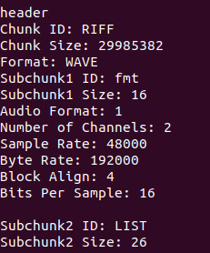

# C Wav-files change-programs pack

  

Use of this software assumes **user** knowledge of:  
1. What is a directory.
2. How to open a terminal in the desired directory.
3. How to use the executable file in the terminal.
4. Application of the following analogy:  
  If the program `./build/cut_in_wav` prints help  
"""  
  Параметры:  
   [ -i | --input ] <входной_файл>   
   [ -s | --start ] <начало>  
   [ -e | --end ]   <конец>  
   [ -o | --output ] <выходной_файл>  
   --test   вывод статистики предполагаемого результата  
"""  
  Then you need to use it with the template `./build/cut_in_wav -i <input_file> -s <start of cutting> -e <end of cutting> -o <output_file>`.  
  
  
A set of code for reading and changing wav files.  
Programs for reading and editing wav files.  
Processes only PCM-compatible formats (
see [WAVE Specifications/rfc2361.txt](../WAVE%20Specifications/rfc2361.txt) line 300, 
or [WAVE Specifications/Wave File Specifications.html](../WAVE%20Specifications/Wave%20File%20Specifications.html)
).  
  
Available programs:  
- `wav_info`
- `concat_wav`
- `mult_wav`
- `cut_int_wav`
- `cut_out_wav`
- `insert_wav`
- `two_channels_wav`
- `form_pitch`
- `zero_wav (null_wav)`
- `1_hour_wav`
- `fan_1_hour_wav`

#### Description of programs
- wav_info  
Displays information about the wav file.

- concat_wav  
Concatenates 2 wav files of similar format.

- mult_wav  
Concatenates a wav file with itself.

- cut_in_wav  
Cuts a gap of specified length.

- cut_out_wav  
Cut out fragment, with smooth transition possibility (parametr -m).  

- insert_wav  
Insert *second* into *first* audio.  

- two_channels_wav  
Converts mono to stereo (dublicate single channel).  

- form_pitch  
Records a sound wave of the desired frequency and amplitude

- zero_wav (null_wav)  
Creates an empty wav file with a specified duration.

- 1_hour_wav  
Extends audio to a specified duration by copying the selected fragment.  

- fan_1_hour_wav  
Same as 1_hour_wav, but with incorrect byte decoding, leading to strange results.


### Assembly (compilation)
Go to the **root** directory and use the command with the template `make <program_name>`, where *<program_name>* is the name of the program from the *Available programs* list. Compiles the program into the **build** directory.   
Example command:
```
make cut_in_wav
```
This will create the *cut_in_wav* executable in the **build** directory (*cut_in_wav.exe* on Windows).  
  
Or compile all programs at once!
```
make all
```

### How to use?
1. Compile the selected program.
2. Move it to your working directory (where the 'working'-wave files are located).
3. Open a terminal (console) there.
4. Write a command using the template:  
For Windows: `<program_name>.exe [options]`  
For Linux: `./<program_name> [options]`  
  
If the parameters are not specified, help for use is displayed.  
All examples are for Linux (differing `./`).  
  
Program parameters:
##### wav_info  
\<input_file\> - path to the input file.  
   
Example:  
```
./build/wav_info samples/Sidorovich.wav
```
Prints header information *Sidorovich.wav*  
  
##### concat_wav  
 \<input_file1\> \<input_file2\> \<output_file\> - paths to the files.  
 \<input_file1\> and \<input_file2\> must be different! To repeat a file, use mult_wav.  
  
Example:  
```
./build/concat_wav "samples/phrase 1.wav" "samples/phrase 2.wav" "concated phrase.wav"
```
Concatenates wav files *phrase 1.wav* and *phrase 2.wav* **of the same format** into *concated phrase.wav* .  
  
##### mult_wav
-i <input_file> - path to the input file.  
-o <output_file> - path to the output file.  
-c <repetitions> - number of occurrences of *input* in *output* file ( >1 ).  
  
Example:  
```
./build/mult_wav -i samples/Sidorovich.wav --count 3 --output "Wash now.wav"
```
There will be 3 consecutive *Sidorovich.wav* in *Wash now.wav* .
  
  
##### cut_in_wav  
-i \<input_file\> -o \<output_file\> -s \<start of trimming\> -e \<end of trimming\>  
Tags are written in `HH:MM:SS.MS` format.  
  
Example:  
```
./build/cut_in_wav -i "samples/Tchaikovsky - Piano Concerto 1 (B Flat Minor).wav" -s 2:20 -e 3:5.2 -o "sonata-allegro.wav"
```
Cuts a fragment from *Tchaikovsky - Piano Concerto 1 (B Flat Minor).wav* [^1] into *sonata-allegro.wav*, starting from the second minute 20 seconds, ending with the third minute 5 seconds 2 tenths of a second.  

[^1]: Need to convert to wav:   
`ffmpeg -i "samples/Tchaikovsky - Piano Concerto 1 (B Flat Minor).ogg" "samples/Tchaikovsky - Piano Concerto 1 (B Flat Minor).wav"`  

##### two_channels_wav  
-i <input_file> -o \<output_file\>  

Example:  
```
./build/two_channels_wav --input samples/Sidorovich.wav -o stereo.wav
```
*stereo.wav* - stereo sound, as opposed to *Sidorovich.wav* with mono.  
  
##### zero_wav (null_wav)  
-o \<output_file\> -d \<duration\>   
duration is written in `HH:MM:SS.MS` format.  

Example:  
```
./build/zero_wav -o null.wav -d 6:5.43
```
Creates an empty wav file *null.wav*, lasting 6 minutes 5 seconds + 43 hundredths of a second.  
  
##### form_pitch  
\<output file name\> \<Frequency\> \<amplitude (volume)\> \<duration in seconds\>  

Example:  
```
./build/form_pitch_wav A.wav 440.00 0.5 1
```
Creates a wave with a frequency of 440 Hertz (Note A), duration 1 second, volume 0.5 (some volume). 

##### 1_hour_wav
-i \<input_file\> -st \<repeat start\> -end \<repeat end\> ​​-md \<overlay duration\> -ed \<expected duration\> -o \<output file\>  
Adding --test prints the parameters of the intended output file.  

Example:
```
./build/1_hour_extender -i "samples/The Amazing Digital Circus - Main Theme.wav" -st 35.5 -end 48.3  -ed 3:28  -o "day after day after day.wav" -md 0.3
```
Start before 34.5 seconds   
 \+ dublicate period from 34.5 to 01:33.2  twice (see `--test`)   
 \+ end from 01:33.2 to 01:52.34   
result = 3 minutes 45 seconds.

